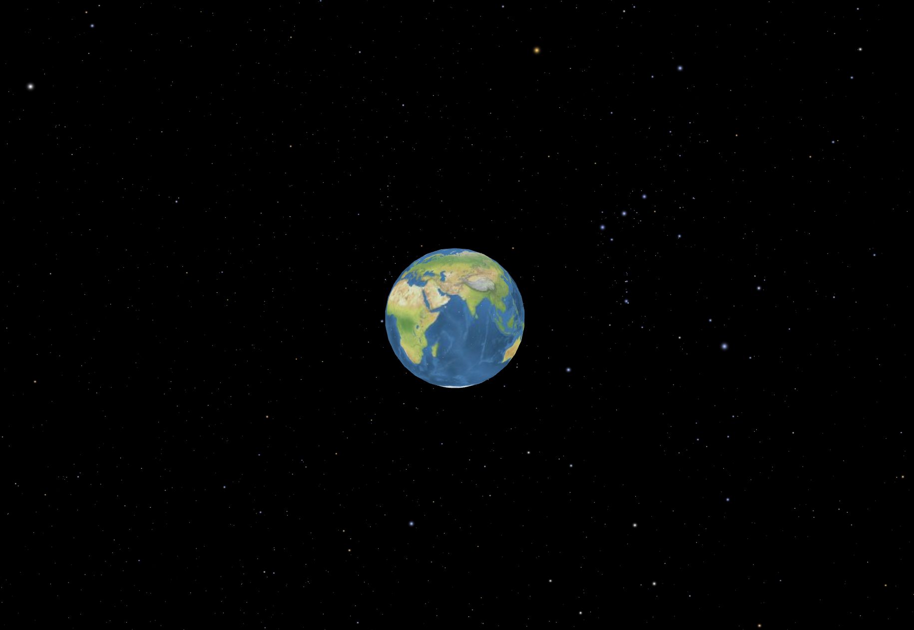

# AnotherCesiumSkybox



用 **Cesium `BillboardCollection`** 绘制 NASA Eyes 风格星空，**替换默认 SkyBox 立方体贴图**。默认从 **CDN** 加载 Cesium.js，无需 npm 即可运行。

中文原理说明见 [`skybox原理.md`](./skybox原理.md)。

## 快速运行 / Quick start

星表 `.dat` 需通过 HTTP 拉取，请勿用 `file://` 直接打开。

**Windows（推荐）：** 双击 `serve.bat`，浏览器打开提示的地址（默认 <http://localhost:8080>）。

**macOS / Linux：**

```bash
./serve.sh
# 或: python3 -m http.server 8080
```

然后打开 <http://localhost:8080/>。

### English

1. Serve the repo root over HTTP (`.bat` / `serve.sh` / any static server).
2. Open `index.html` via that server.
3. Cesium is loaded from a pinned CDN build (`1.145`); no Ion token is required for this starfield demo.

## 仓库结构

```
index.html              # CDN Cesium 入口，关闭默认 SkyBox
js/starfield.js         # BillboardCollection 星空 + ICRF→Fixed 锁定
assets/eyes-stars/      # stars.0–5.dat / galaxies.0.dat（SolarViewer / NASA Eyes）
skybox原理.md           # 中文原理
serve.bat / serve.sh    # 本地静态服务（可选）
vercel.json             # Vercel 静态部署（.dat 以内联二进制提供）
test/starfieldParseTest.js
AGENTS.md
```

## 部署到 Vercel

仓库根目录已有 `vercel.json`：静态站点、无构建；`assets/eyes-stars/*.dat` 会带 `Content-Type: application/octet-stream` 与 `Content-Disposition: inline`，避免浏览器弹出下载。

```bash
npx vercel
# 生产环境: npx vercel --prod
```

或在 [Vercel](https://vercel.com) 导入本仓库，Framework Preset 保持 Other / 无框架即可。

## 实现要点

- **渲染：** `Cesium.BillboardCollection`（非默认 `SkyBox`，亦非 `PointPrimitive`）。
- **数据：** `assets/eyes-stars/stars.0.dat` … `stars.5.dat` 与 `galaxies.0.dat`（自 ASTROX.SolarViewer 同步的 NASA Eyes 星表；布局见该目录 README）。
- **惯性锁：** 每帧 `computeIcrfToFixedMatrix` 写入 collection 的 `modelMatrix`。
- **无 Ion：** 地球用 Cesium 自带 `NaturalEarthII` 静态影像；星空按 Eyes / SolarViewer 的 flux 针尖精灵绘制。

### 可选：本地 Cesium 拷贝

若需离线调试，可将 Cesium 构建放到例如 `vendor/cesium/`，并改 `index.html` 中的 script/css 路径；日常演示仍以 CDN 为准。

## 来源说明

星表来自 [NASA Eyes on the Solar System](https://eyes.nasa.gov/apps/solar-system/) 的静态点源目录：

- 原始文件：`https://eyes.nasa.gov/assets/static/stars/stars.0.bin` … `stars.5.bin` 与 `galaxies.0.bin`（入库改为 `.dat`，避免 Windows 浏览器把 `.bin` 当附件下载）
- 亮度、尺寸与片元核复刻 Eyes `StarfieldComponent` 着色器（由 `absMag` 与星表真实距离算 flux，再压成针尖精灵）
- 离线下载入库时需带 Referer `https://eyes.nasa.gov/apps/solar-system/`；运行时只读本仓库 `assets/eyes-stars/`，不热链 Eyes CDN

二进制布局见 [`assets/eyes-stars/README.md`](./assets/eyes-stars/README.md)。

## 许可

演示代码以本仓库许可为准。`assets/eyes-stars/` 中的二进制来自 NASA Eyes 静态资源；公开分发时请自行确认相关许可。
